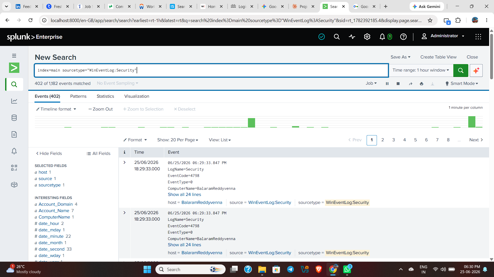
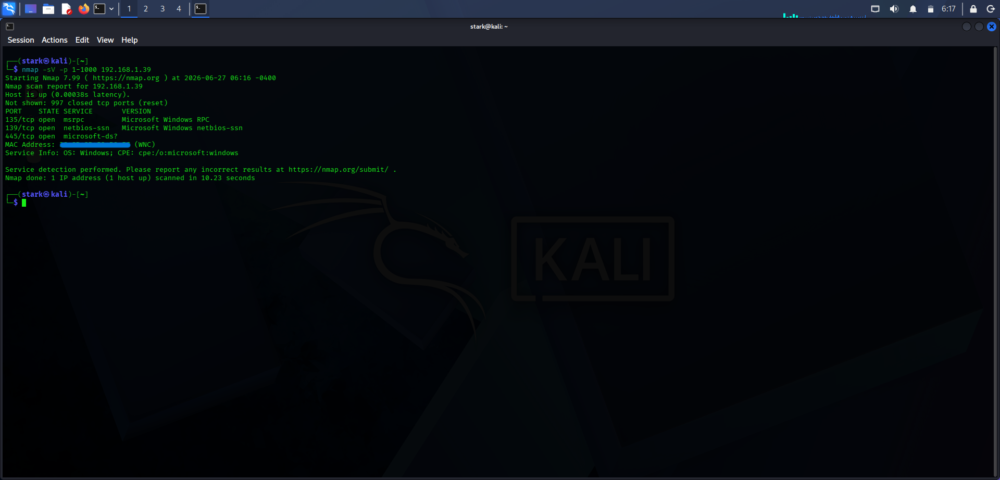
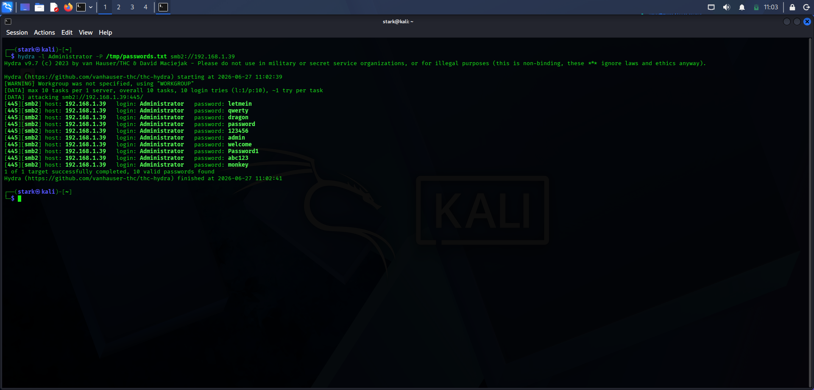
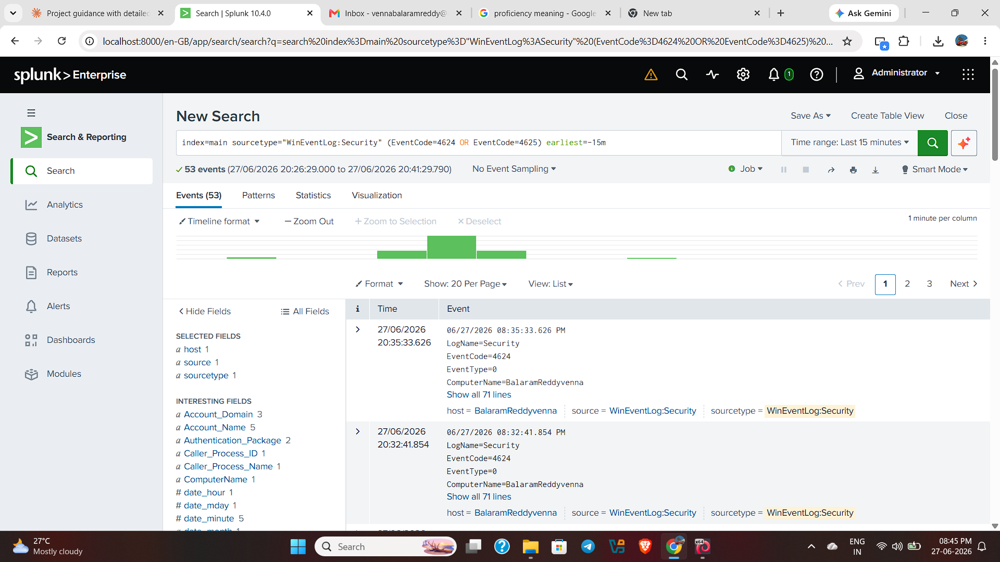
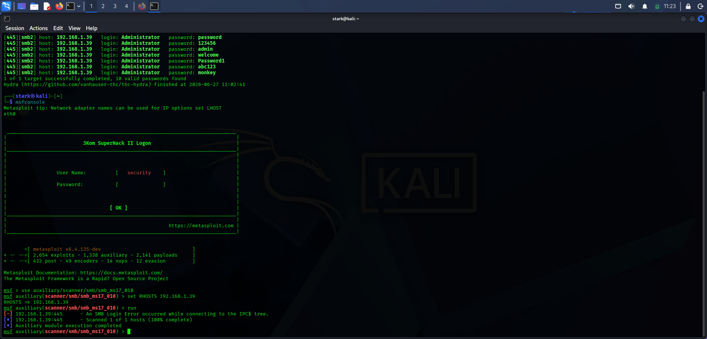
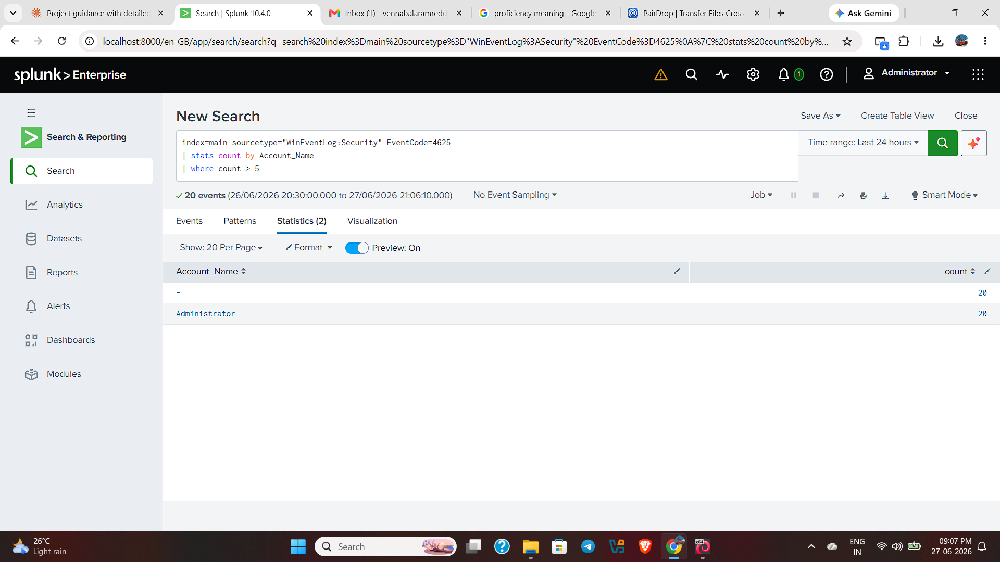
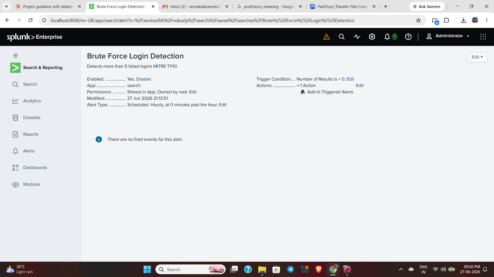
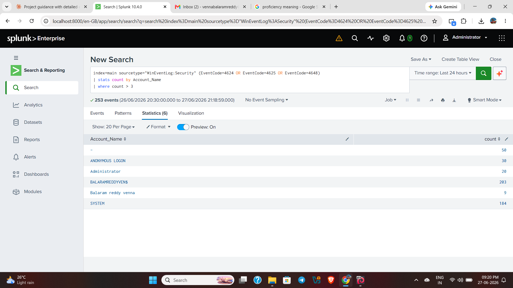
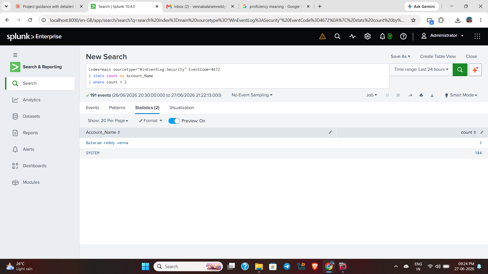

# 🛡️ Splunk SIEM Lab — Attack Simulation & Detection Engineering

> A hands-on home lab project demonstrating real-world attack simulation, SIEM detection engineering, and SOC analyst incident reporting using Splunk Enterprise and Kali Linux.

---

## 📌 Project Overview

This project simulates a real SOC (Security Operations Center) environment where:
- A **Kali Linux VM** acts as the attacker machine
- A **Windows 11** machine runs **Splunk Enterprise** as the SIEM
- Real attacks are launched from Kali → detected and alerted in Splunk
- Incident reports are written exactly like a real SOC analyst would

---

## 🧰 Tools & Technologies

| Tool | Purpose |
|------|---------|
| **Splunk Enterprise** | SIEM — log collection, detection, alerting |
| **Kali Linux (VirtualBox VM)** | Attacker machine — attack simulation |
| **Nmap 7.99** | Network reconnaissance scanning |
| **Hydra v9.7** | Brute force password attack |
| **Metasploit Framework v6.4** | SMB exploitation attempt |
| **Windows Event Logs** | Log source for Splunk |
| **MITRE ATT&CK Framework** | Attack technique mapping |
| **VirtualBox** | Virtualization platform |

---

## 🗺️ Project Phases

### ✅ Phase 1 — Splunk Setup
- Installed Splunk Enterprise on Windows 11
- Configured Windows Event Log data inputs (Security, System, Application)
- Verified log collection — 1,182+ events collected

### ✅ Phase 2 — Attack Simulation (from Kali Linux)

| # | Attack | Tool | MITRE Technique | Target |
|---|--------|------|----------------|--------|
| 1 | Network Port Scan | Nmap | T1046 — Network Service Scanning | Windows 11 (192.168.1.39) |
| 2 | Brute Force Login | Hydra | T1110 — Brute Force | SMB Port 445 |
| 3 | SMB Exploitation Attempt | Metasploit | T1059 — Command Execution | MS17-010 (EternalBlue) |

### ✅ Phase 3 — Detection Engineering (Splunk Alerts)

| # | Alert Name | Detects | MITRE |
|---|-----------|---------|-------|
| 1 | Brute Force Login Detection | 5+ failed logins on same account | T1110 |
| 2 | SMB Probe and Reconnaissance Detection | Anonymous logon attempts via SMB | T1046 |
| 3 | Privilege Escalation Detection | Special privilege assignments | T1078 |

### ✅ Phase 4 — Incident Reports
- Written in professional SOC analyst format
- Each report covers: Summary, Timeline, Detection Method, Evidence, Impact, Recommendations, MITRE Mapping

### ✅ Phase 5 — GitHub Documentation
- All screenshots, reports, and writeups uploaded

---

## 📸 Screenshots

### Phase 1 — Splunk Collecting Windows Logs


### Attack 1 — Nmap Port Scan from Kali


### Attack 2 — Hydra Brute Force from Kali


### Attack 2 — Splunk Detecting Brute Force (53 Events)


### Attack 3 — Metasploit SMB Exploitation Attempt


### Detection Rule 1 — Brute Force Login Detection


### Detection Rule 1 — Alert Saved in Splunk


### Detection Rule 2 — SMB Probe Detection


### Detection Rule 3 — Privilege Escalation Detection


---

## 🔍 Splunk Detection Queries

### Brute Force Detection (T1110)
```spl
index=main sourcetype="WinEventLog:Security" EventCode=4625
| stats count by Account_Name
| where count > 5
```

### SMB Probe and Reconnaissance Detection (T1046)
```spl
index=main sourcetype="WinEventLog:Security" (EventCode=4624 OR EventCode=4625 OR EventCode=4648)
| stats count by Account_Name
| where count > 3
```

### Privilege Escalation Detection (T1078)
```spl
index=main sourcetype="WinEventLog:Security" EventCode=4672
| stats count by Account_Name
| where count > 2
```

---

## 📄 Incident Reports

| Report | Attack | MITRE | File |
|--------|--------|-------|------|
| INC-2026-001 | Brute Force Login Attack | T1110 | [View Report](incident-reports/Incident-Report-1-BruteForce.docx) |
| INC-2026-002 | Network Reconnaissance Scan | T1046 | [View Report](incident-reports/Incident-Report-2-Reconnaissance.docx) |
| INC-2026-003 | SMB Exploitation Attempt | T1059 | [View Report](incident-reports/Incident-Report-3-Metasploit.docx) |

---

## 🎯 Key Findings

| Finding | Detail |
|---------|--------|
| **Open Ports Discovered** | 135 (RPC), 139 (NetBIOS), 445 (SMB) |
| **Brute Force Events** | 20 failed/successful login attempts detected |
| **Anonymous Logon Attempts** | 30 suspicious anonymous SMB connections |
| **Total Events Analyzed** | 1,182+ Windows Security events |
| **Detection Rules Created** | 3 Splunk scheduled alerts |
| **Incident Reports Written** | 3 professional SOC reports |

---

## 📚 What I Learned

- How to set up and configure **Splunk Enterprise** as a SIEM
- How to perform **network reconnaissance** using Nmap
- How to execute **brute force attacks** using Hydra
- How to use **Metasploit Framework** for vulnerability scanning
- How to write **Splunk SPL queries** to detect attacks
- How to create **scheduled detection alerts** in Splunk
- How to write **professional SOC incident reports**
- How to map attacks to the **MITRE ATT&CK framework**

---

## ⚠️ Disclaimer

This project was conducted in a **controlled home lab environment** for educational purposes only. All attacks were performed on machines I own. This project is intended to demonstrate defensive security skills.

---

## 👤 Author

**Balaram Reddy Venna**
Aspiring SOC Analyst | Detection Engineer
📧 vennabalaramreddy@gmail.com

---

*This project was built as part of my cybersecurity portfolio to demonstrate hands-on SIEM and detection engineering skills.*
